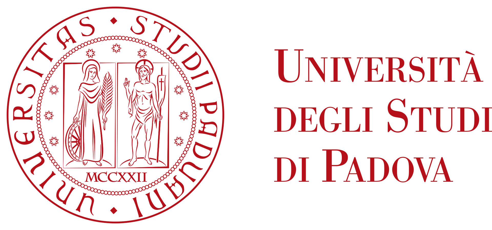
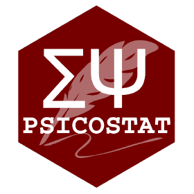

# Prospettive interdisciplinari nella misura di competenze e capacità linguistiche in età scolare

Working-workshop - 25 Giugno 2024 - Padova

[locandina](Prospettive25062024.png)

--------

Programma

9.00 - 11.00 [La prospettiva dei nuovi strumenti](strumenti.md)

11.20 -13.00 [Paradigmi, Risorse e Tecnologie Open Science per la Misura del Linguaggio](paradigmi-tecnologie-risorse.md)

15.00 - 16.30 [Implicazioni nell'ambito del testing e della pratica professionale in psicologia](tavola.md)

---------

Organizzazioe scientifica: Francesco Vespignani, Giulia Calignano

Il workshop è partocinato dal Dipartimento di Psicologia dello Sviluppo e della Socializzazione dell'Università degli Stdui di Padova, finanziato all'interno del progetto SID-2022 *``Skilled Readers''* (PI Francesco Vespignani) con la collaborazione di [Psicostat](https://psicostat.dpss.psy.unipd.it/).

[image, heigth="80"](sitoGiornata2506.png)
